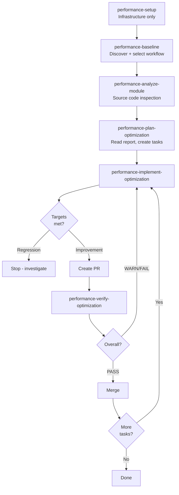

# Performance Optimization Workflow Guide

Quick reference for using the performance optimization workflow in sdlc-workflow plugin.

---

## Overview

**Purpose:** Measure, analyze, and improve frontend application performance using automated metrics collection, anti-pattern detection, and Jira-integrated planning.

**When to use:**
- ✅ Feature is functionally complete but has performance issues
- ✅ Establishing performance baseline before changes
- ✅ Identifying bottlenecks in a user journey
- ✅ Preparing for release (validate targets)

**When NOT to use:**
- ❌ Building new features from scratch → use `plan-feature`
- ❌ Fixing non-performance bugs → use `implement-task`

---

## Prerequisites

| Requirement | Details |
|---|---|
| Playwright installed | `npm install -D @playwright/test && npx playwright install` |
| Application running | Localhost (e.g., `http://localhost:3000`) |
| Test data loaded | Representative data for accurate measurements |
| Stable environment | Close unnecessary apps, disable browser extensions |

---

## Workflow Steps

```
setup (infrastructure only) → baseline (workflow discovery + metrics) → analyze → plan → implement → verify
```

| Step | Skill | Purpose | Output |
|---|---|---|---|
| 1 | `performance-setup` | Initialize infrastructure (dirs, settings, backend config) | Minimal `.claude/performance-config.json` (no workflow) |
| 2 | `performance-baseline` | **Discover workflows**, **select workflow**, **select mode**, capture metrics | `baseline-report.md` with Core Web Vitals, config updated with workflow |
| 3 | `performance-analyze-module` | **Inspect source code** to detect anti-patterns | `workflow-analysis-report.md` with findings |
| 4 | `performance-plan-optimization` | **Read analysis report** and create Jira tasks | Jira Epic + Tasks, `optimization-plan.md` |
| 5 | `performance-implement-optimization` | Execute optimization with validation | PR with before/after metrics |
| 6 | `performance-verify-optimization` | Verify PR and detect regressions | Verification report (PASS/WARN/FAIL) |

**Key distinction:** Step 4 analyzes code, Step 5 reads the report.

---

## Workflow Diagram



---

## Baseline Capture Mode

All baseline captures use **cold-start** mode: direct URL navigation with an empty browser cache. This measures worst-case (first-visit) performance and provides a stable, reproducible baseline.

> **Note:** e2e and both modes are not implemented. Only cold-start is supported.

---

## Quick Example

```bash
# 1. Setup infrastructure (one-time)
/sdlc-workflow:performance-setup
# Creates directories, configures settings and backend

# 2. Start app and discover workflows + capture baseline
npm start  # Start app first
/sdlc-workflow:performance-baseline
# Discovers workflows → User selects "Product Catalog Browse"
# Output: LCP 3200ms (target 2500ms) ⚠️

# 3. Analyze source code
/sdlc-workflow:performance-analyze-module
# Output: 3 anti-patterns detected, 900ms improvement estimated

# 4. Create Jira tasks
/sdlc-workflow:performance-plan-optimization
# Output: Epic TC-5001, Tasks TC-5002, TC-5003, TC-5004

# 5. Implement optimization
/sdlc-workflow:performance-implement-optimization TC-5002
# Output: PR created, optimization report saved, LCP improved 3200ms → 2900ms

# 6. Verify PR
/sdlc-workflow:performance-verify-optimization TC-5002
# Output: PASS (Partial Success - continue with remaining tasks)

# 7. After PR merge to main, update config with fresh baseline
git checkout main && git pull
/sdlc-workflow:performance-baseline
# Output: Config "Latest Verified" column updated with current main metrics

# 8. Repeat steps 5-7 for TC-5003, TC-5004 until targets met
```

---

## Optimization Result Reports

Each optimization task creates an isolated report file for audit trail and parallel-safe development:

**Location:** `.claude/performance/optimization-results/{jira-key}-{timestamp}.md`

**Contents:**
- Performance impact table (baseline → after optimization → delta)
- Test scenarios measured
- Code changes (commit, PR, files modified)
- Validation checks performed
- Verification results (added by verify-optimization)

**Status lifecycle:**
1. `pending_verification` — created by implement-optimization
2. `verified` — updated by verify-optimization if PASS
3. `verified_with_warnings` — if WARN (partial success)

**Benefits:**
- ✅ **Parallel-safe:** Multiple developers can optimize different tasks simultaneously without conflicts
- ✅ **Audit trail:** Full history of every optimization attempt preserved
- ✅ **Traceability:** Each report links to task → PR → commit → metrics

**Config update flow:**
- Optimization reports track per-task results (isolated, parallel-safe)
- Config "Latest Verified" column tracks main branch state (updated by re-running baseline after merge)
- This separation eliminates race conditions while preserving full history

---

## Anti-Patterns Detected (Step 3)

| Anti-Pattern | Detection |
|---|---|
| Over-fetching | API responses with unused fields |
| N+1 queries | Sequential API calls in loops |
| Waterfall loading | Sequential resource dependencies |
| Render-blocking | Synchronous scripts/styles in `<head>` |
| Unused code | Dead code, unreachable branches |
| Expensive re-renders | Missing React.memo, useMemo |
| Long tasks | Main thread blocking > 50ms |
| Layout thrashing | Forced reflows in loops |
| Missing lazy loading | Large components loaded eagerly |

---

## Common Issues

| Issue | Solution |
|---|---|
| "ECONNREFUSED" during baseline | Start application: `npm start` |
| "Cannot find module @playwright/test" | Install: `npm install -D @playwright/test && npx playwright install` |
| Metrics vary >10% between runs | Close background apps, clear cache, use consistent test data |
| "Performance regression detected" | Review implementation, check for unintended side effects |
| "Atlassian MCP failed" | Choose "Use REST API" when prompted, or skip Jira operations |

---

## Best Practices

**Re-baseline when:**
- Before starting optimization (establish baseline)
- **After each optimization PR merge** (update "Latest Verified" metrics on main)
- After major features (validate no regressions)
- After library upgrades (detect version-related slowdowns)
- Before releases (ensure targets met)

**Post-merge workflow:**
1. Merge optimization PR to main
2. Checkout main and pull latest
3. Re-run `/sdlc-workflow:performance-baseline` (skips workflow discovery, just re-measures)
4. Config "Latest Verified" column updated with fresh main metrics
5. Continue with next optimization task

**Prioritization:**
- Quick wins first (low effort, high impact)
- Dependencies (tasks that unblock others)
- Low-risk before high-risk

**Target setting:**
- Use industry benchmarks (see [Performance Metrics Guide](performance-metrics-guide.md))
- Set intermediate targets if baseline is far from benchmark
- Adjust for application complexity and user expectations

**Iteration pattern:**
- **Incremental:** One task → verify → merge → repeat (lower risk)
- **Batched:** Multiple tasks → verify → merge (fewer PRs)

**Regression threshold:** 5% degradation in non-target scenarios triggers investigation

---

## See Also

- [Performance Skills Reference](performance-skills-reference.md) - Detailed skill documentation
- [Performance Metrics Guide](performance-metrics-guide.md) - Metric definitions and thresholds
- [Workflow Documentation](workflow.md) - Full workflow catalog
