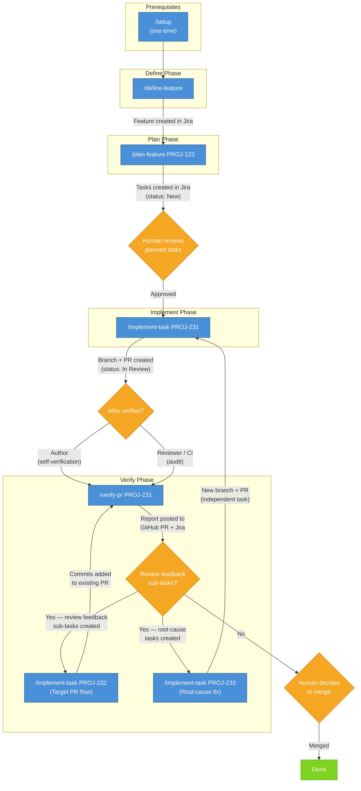

# SDLC Workflow

This document describes the execution workflow for the sdlc-workflow plugin skills.

## Workflow Overview



**Jira state transitions:** New → In Progress (implement-task) → In Review (implement-task) → Done (human merge)

---

## Prerequisite: Setup

**Skill:** `/sdlc-workflow:setup`

Configures a project's CLAUDE.md with the required `# Project Configuration` section. This is a one-time prerequisite for all other skills — plan-feature, implement-task, and verify-pr all validate Project Configuration before executing and will stop if it is missing.

**Invocation:**

```
/sdlc-workflow:setup
```

The setup skill is idempotent — running it multiple times on an already-configured project produces no changes. See [docs/project-config-contract.md](project-config-contract.md) for the required configuration structure.

---

## Execution Phases

The workflow follows four phases: **Define**, **Plan**, **Implement**, and **Verify**.

### Define Phase

**Skill:** `/sdlc-workflow:define-feature`

Interactively walks the user through all Feature description template sections and creates a fully-described Feature issue in Jira.

**Invocation:**

```
/sdlc-workflow:define-feature
/sdlc-workflow:define-feature My Feature Title
```

**Workflow:**
1. Validate Project Configuration in CLAUDE.md
2. Present a roadmap of the 9 template sections
3. Collect Feature summary (title)
4. Walk through each section interactively (with skip support)
5. Offer self-assignment
6. Preview the full description and collect approval
7. Create the Feature issue in Jira (labeled `ai-generated-jira`)
8. Post a summary comment and suggest `/plan-feature` as the next step

**Output:**
- Feature issue created in Jira with a structured description
- Summary comment on the created issue

**Guardrails:**
- Jira-only — no filesystem modifications permitted
- All description content must come from user input — no fabrication
- Issue is never created without user preview and approval

---

### Plan Phase

**Skill:** `/sdlc-workflow:plan-feature`

Converts a Jira feature into structured implementation tasks.

**Inputs:**
- Jira feature issue ID (required)
- Figma design URL (optional)

**Invocation:**

```
/sdlc-workflow:plan-feature PROJ-123
/sdlc-workflow:plan-feature PROJ-123 https://www.figma.com/design/abc123/MyDesign
```

**Workflow:**
1. Validate Project Configuration in CLAUDE.md
2. Fetch feature from Jira
3. Retrieve Figma mockups (if available)
4. Analyze repositories using Serena or fallback tools
5. Build a Repository Impact Map
6. Generate structured Jira tasks with dependencies

**Output:**
- Implementation tasks created in Jira (labeled `ai-generated-jira`)
- Impact map comment on the feature issue
- Issue links (feature incorporates tasks, task dependency chains)

**Guardrails:**
- Planning-only — no file modifications permitted
- All output goes to Jira, never to the filesystem

---

### Implement Phase

**Skill:** `/sdlc-workflow:implement-task`

Takes a structured Jira task and implements it: modifies code, runs tests, commits, opens a PR, and updates Jira.

**Invocation:**

```
/sdlc-workflow:implement-task PROJ-231
```

**Workflow:**
1. Validate Project Configuration in CLAUDE.md
2. Fetch and parse the Jira task description
3. Verify dependencies are Done
4. Transition task to In Progress and assign to current user
5. Inspect code using Serena or fallback tools
6. Create feature branch (named after the Jira issue ID)
7. Implement changes scoped to the task
8. Write and run tests
9. Verify acceptance criteria
10. Self-verify scope containment and sensitive patterns
11. Commit (Conventional Commits, Jira ID in footer, assisted-by trailer)
12. Push branch and open PR
13. Update Jira (PR link, comment, transition to In Review)

**Guardrails:**
- Changes scoped to files listed in the task — no unrelated refactoring
- Code must be inspected before modification
- Incomplete descriptions require user clarification, not improvisation

---

### Verify Phase

**Skill:** `/sdlc-workflow:verify-pr`

Verifies a pull request against its originating Jira task's acceptance criteria and deterministic guardrails. The skill operates on local code for acceptance criteria verification, so it conditionally checks out the PR branch before inspecting files.

**Use cases:**

- **Author self-verification** — the contributor who ran `/implement-task` already has the PR branch checked out locally. The skill detects this and proceeds without a checkout.
- **Reviewer/CI audit** — another person or a headless CI job runs `/verify-pr` from an arbitrary branch. The skill detects the branch mismatch and checks out the PR branch automatically.

**Inputs:**
- Jira task issue ID with an associated PR (required)

**Invocation:**

```
/sdlc-workflow:verify-pr PROJ-231
```

**Workflow:**
1. Validate Project Configuration in CLAUDE.md
2. Fetch and parse the Jira task description
3. Identify the PR from the Jira custom field
4. Checkout the PR branch if not already on it
5. Review feedback resolution — read PR reviews, create sub-tasks for code change requests
6. Root-cause investigation — trace defects through the full workflow chain
7. Scope containment — compare changed files against the task
8. Diff size check
9. Commit traceability — verify Jira ID in commit messages
10. Sensitive pattern scan
11. CI status check
12. Acceptance criteria verification using local code inspection
13. Verification commands (if specified in the task)
14. Generate and post verification report to GitHub PR and Jira

**Output:**
- Verification report posted to both GitHub PR (as a PR comment) and Jira (as an issue comment)
- Review feedback sub-tasks created in Jira (with "Blocks" links and `review-feedback` label)
- Root-cause improvement tasks created in Jira (with `root-cause` label)
- No merge action taken
- No Jira status transition

**Guardrails:**
- Verification-only — does not modify code, merge the PR, or transition the Jira issue
- Criteria come from the Jira task description, not from reading the diff
- Report is informational — a human reviewer decides whether to merge
- Sub-tasks and root-cause tasks are informational — they track required fixes and systemic improvements but do not block verification

> **Design intent:** This workflow builds the foundation for safe auto-merge. Jira
> becomes the source of truth via blocking sub-tasks: once proven reliable, a future
> enhancement adds a merge decision step where verify-pr checks that all blocking
> sub-tasks are Done + all verification checks PASS + CI passes, then auto-merges.
> Auto-merge itself is out of scope for now — but every design decision aligns with
> this end state.

---

## Performance Optimization Workflow

The performance optimization workflow is a specialized workflow for discovering, analyzing, and optimizing application performance across **full-stack applications** (frontend + backend). It operates independently of the main SDLC workflow but follows a similar structured approach.

### Analysis Capabilities

**Supported Architecture Modes:**
1. **Frontend-only** - Frontend analysis capabilities only
2. **Backend-only** - Backend analysis capabilities only
3. **Full-stack (separate repos)** - Frontend + Backend capabilities + cross-repository integration
4. **Full-stack monorepo** - Frontend + Backend capabilities + cross-repository integration

**Frontend Analysis Capabilities:**
- Bundle composition analysis (third-party vs application code, code-splitting opportunities)
- Component render optimization (missing memoization, expensive re-renders)
- Resource loading patterns (waterfall loading, render-blocking resources)
- Client-side anti-patterns (long tasks, layout thrashing, unused code)
- API call patterns from frontend (N+1 queries, sequential vs parallel fetching)
- Supported frameworks: React, Vue, Angular, Svelte, Next.js, Nuxt, SvelteKit
- Supported bundlers: webpack, Vite, Rollup, esbuild, Parcel

**Backend Analysis Capabilities:**
- Database N+1 query detection (queries in loops)
- Deep service chain analysis (recursive call graph tracing to detect hidden N+1, wasted computation, and anti-patterns below the handler layer)
- Wasted computation detection (handlers fetching more data than they use)
- Missing database index detection (WHERE/JOIN columns lacking indexes, cross-referenced against migration files)
- Missing pagination on collection endpoints
- Missing caching for expensive operations
- Inefficient queries (SELECT *, unnecessary columns)
- Unused table JOINs (joined tables with no field access)
- Response schema extraction for over-fetching analysis
- Supported frameworks: Rust (actix-web, axum, rocket), Java (Spring Boot), Python (FastAPI, Django, Flask), Node (Express, Fastify, Nest.js), Ruby (Rails), C# (ASP.NET Core)
- Supported ORMs: sqlx, SeaORM, Diesel, JPA/Hibernate, SQLAlchemy, Django ORM, TypeORM, Prisma, Sequelize, ActiveRecord, Entity Framework

**Full-Stack Analysis:**

When both frontend and backend are configured, combines **Frontend Analysis Capabilities** + **Backend Analysis Capabilities** with additional cross-repository integration:
- **Comprehensive over-fetching detection:** Cross-reference backend response schemas with frontend field usage to identify unused fields
- **N+1 impact multiplier:** Calculate combined impact of frontend N+1 patterns × backend query overhead
- **End-to-end optimization planning:** Coordinate API response size reduction (backend) with API call pattern improvements (frontend)

**Code Intelligence Strategy:**
- **Serena MCP** (preferred): High-confidence semantic code analysis
- **Grep fallback**: Medium-confidence pattern matching (used when Serena unavailable)
- All findings document detection method and confidence level

---

### Performance Setup (One-time)

**Skill:** `/sdlc-workflow:performance-setup`

Initializes Performance Analysis infrastructure by creating directories, configuring backend repository, and setting baseline capture settings and optimization targets. **Does NOT select workflow** (workflow discovery happens in baseline skill).

**Invocation:**

```
/sdlc-workflow:performance-setup
/sdlc-workflow:performance-setup /path/to/target/repo
```

**Workflow:**

**Step 0.5: Repository Architecture Selection (Interactive)**

Prompts user to select repository architecture:
1. Full-stack (separate repositories) - Frontend + backend in different repos
2. Full-stack monorepo - Frontend + backend in same repo
3. Frontend-only - No backend analysis
4. Backend-only - No frontend analysis
5. Not sure - Auto-detect based on repository patterns

**Step 1: Detect Repository Patterns and Validate Choice**

Based on selection, validates target repository contains expected patterns:

**Step 1.2: Validate Architecture Choice (Branching Logic)**
- **Full-stack/monorepo:** Verify BOTH frontend AND backend patterns exist
- **Full-stack (separate repos):** Verify frontend in current repo, prompt for backend repo path, validate backend patterns
- **Frontend-only:** Verify frontend patterns exist (skip if backend detected, offer to reconfigure as full-stack)
- **Backend-only:** Verify backend patterns exist (skip if frontend detected, offer to reconfigure as full-stack)
- **"Not sure":** Auto-detect and recommend architecture based on discovered patterns

**Step 1.3: Backend Framework Configuration (Interactive Detection Flow)**

Runs ONLY if backend detected or provided:
1. **Framework detection:** Auto-detect from patterns (Rust: Cargo.toml, Java: pom.xml, Python: requirements.txt, etc.)
2. **Framework confirmation:** Present detected framework to user for confirmation
3. **API base path prompting:** Request API base URL/path for backend
4. **Serena instance lookup:** Check CLAUDE.md Repository Registry for Serena MCP configuration
5. **Registry fallback:** If Serena not in registry, set to "none" (Grep fallback mode)
6. **User approval:** Confirm final backend configuration before saving

**Main Flow:**

1. Determine target repository (argument or current directory)
2. Detect existing configuration (update or skip if exists)
4. Create target directories (`.claude/performance/baselines/`, `/analysis/`, `/plans/`, `/optimization-results/`, `/verification/`)
5. Collect baseline capture settings (iterations, warmup runs, metrics)
6. Collect optimization targets (LCP, FCP, DOM Interactive, Total Load Time)
7. Initialize metadata section with `workflow_selected: false`
8. Generate minimal `.claude/performance-config.json` with:
   - Backend configured
   - Baseline settings configured
   - Optimization targets configured
   - **Empty** Performance Scenarios (will be populated by baseline)
   - **Empty** Module Registry (will be populated by baseline)
   - **Empty** Selected Workflow section (will be populated by baseline)
9. Validate configuration and output summary

**Output:**
- Minimal `.claude/performance-config.json` created in target repository with:
  - Backend Repository Configuration (configured upfront)
  - Baseline Capture Settings (configured)
  - Optimization Targets (configured)
  - Performance Scenarios: empty (note: "populated by baseline")
  - Module Registry: empty (note: "populated by baseline")
  - Selected Workflow: empty (note: "run baseline to select")
  - Metadata: `workflow_selected: false`
- Target directories created:
  - `.claude/performance/baselines/` - Baseline performance reports
  - `.claude/performance/analysis/` - Module and application analysis reports
  - `.claude/performance/plans/` - Optimization plan documents
  - `.claude/performance/optimization-results/` - Individual optimization result reports
  - `.claude/performance/verification/` - Verification reports for optimization PRs

**Guardrails:**
- Idempotent — running multiple times offers to update or skip
- Does NOT modify source code — only creates configuration file
- Does NOT select workflow — that happens in baseline skill
- Backend configuration is interactive detection flow (Steps 1.2-1.3): pattern detection → framework confirmation → API base path prompting → Serena lookup → Registry fallback

**Next step:** Run `/sdlc-workflow:performance-baseline` to discover workflows and capture metrics

---

### Baseline Capture

**Skill:** `/sdlc-workflow:performance-baseline`

**Discovers workflows from the codebase, prompts user to select a target workflow, auto-populates configuration, then captures performance baseline metrics** by executing browser automation to measure page load times and resource loading, and generating a baseline report.

**Invocation:**

```
/sdlc-workflow:performance-baseline
/sdlc-workflow:performance-baseline /path/to/target/repo
```

**Interactive Prompts:**
- **Workflow selection** (first run only): User selects ONE workflow from discovered list
- Test data availability confirmation
- Capture mode: `cold-start` (direct URL navigation with cold cache) - only supported mode

**Workflow:**

**IF workflow not yet selected (first run, `workflow_selected: false`):**

**Frontend Workflow Discovery:**
1. **Discover routes from router configuration**
2. **Infer workflows by grouping related routes** (path prefixes, list→detail patterns, navigation structure)
3. **Auto-populate scenarios from workflow's key screens**
4. **Discover modules for selected workflow pages**

**Backend Workflow Discovery (Step 3):**
- **Step 3.1 - Locate API route definitions** using framework-specific patterns:
  - Rust: actix-web (`#[get("/api/...")]`), axum (`.route("/", get(handler))`), poem
  - Java: Spring Boot (`@GetMapping`, `@PostMapping`, `@RestController`)
  - Python: FastAPI (`@app.get`), Django (`path()`), Flask
  - Node: Express (`app.get`, `router.post`), Fastify, Nest.js
  - Ruby: Rails, C#: ASP.NET Core
  - Discovery: Serena MCP → Grep fallback
  - Extract: HTTP method, path, handler function, file location
- **Step 3.1.1 - Validate endpoint safety via impact analysis:**
  - Count references using Serena `find_referencing_symbols` or Grep
  - Classify: Low (<5 refs), Medium (5-10), High (>10)
  - Flag high-impact endpoints, exclude destructive operations
- **Step 3.2 - Group endpoints into workflows:**
  - Resource-based: `/api/v2/products/*` → "Product Management"
  - Controller-based: `ProductController` → "Product Management"
  - OpenAPI tags: Use spec tags if available
  - Calculate complexity: Simple (1-2 endpoints), Moderate (3-4), Complex (5+)
- **Step 3.3 - Present workflows and prompt selection:**
  - Display table: Workflow Name, Entry Endpoint, Key Endpoints, Complexity, Impact
  - Warn on high-impact workflows
  - User selects one workflow from list
- **Step 3.4 - Auto-populate scenarios from selected workflow:**
  - Generate scenarios from workflow endpoints
  - Naming: `GET /api/v2/products` → `products-get-list`
  - Each scenario: name, endpoint (method + path), description
- **Step 3.5 - Discover modules:**
  - Locate handler functions/service classes for workflow endpoints
  - Serena `get_symbols_overview` → Grep fallback
- **Step 3.6 - Update config:**
  - Performance Scenarios table, Module Registry table, Selected Workflow metadata
  - Set `workflow_selected: true`, `backend_endpoint_discovery_method`

**Workflow Selection by Architecture Mode:**

- **Frontend-only:** Run **Frontend Workflow Discovery**, present workflows, user selects ONE
- **Backend-only:** Run **Backend Workflow Discovery**, present workflows, user selects ONE
- **Full-stack:** Run **Frontend Workflow Discovery** + **Backend Workflow Discovery**, present combined workflows, user selects ONE

**Final Steps (all modes):**
- **Update config** with selected workflow, scenarios, modules
- Set `workflow_selected: true`

**ALWAYS (whether workflow just selected or already selected):**
1. Determine target repository (argument or current directory)
2. Verify Performance Analysis Configuration exists
3. Prompt user to confirm test data availability
4. Baseline capture mode confirmation (cold-start only)
5. Check if baseline already exists (prompt to replace or cancel)
6. Copy capture-baseline.template.mjs from plugin cache to target directory
7. **Dev command discovery and approval:**
   - Check if dev command already configured (with SHA-256 hash verification)
   - If not configured: Discover from package.json (`"dev"`, `"start"` scripts), README.md, CONTRIBUTING.md, Makefile, justfile, framework defaults
   - Extract port from: command flags (`--port`, `-p`), `.env` files, config files, framework defaults
   - Present discovered command to user for approval (allow modification)
   - Update config with approved command and SHA-256 hash
   - Verify application is actually running on discovered port before proceeding
8. Execute script with mode-specific parameters
9. Parse JSON output and generate baseline-report.md from template
10. Filter scenarios to include only those in selected workflow
11. **Update config with baseline metadata** (`baseline_captured: true`, `baseline_mode`, etc.)
12. Save report to configured location (`.claude/performance/baselines/baseline-report.md`)
13. Output summary with key metrics and threshold warnings

**Output:**
- **Config updated** (first run only):
  - Performance Scenarios (auto-derived from selected workflow)
  - Module Registry (lazy-loaded pages from workflow)
  - Selected Workflow metadata
  - Metadata: `workflow_selected: true`
- `baseline-report.md` created in configured baseline directory with per-scenario metrics captured via cold-start mode (cold cache, direct URL navigation)
- Summary output with aggregate metrics and warnings for exceeded thresholds

**Guardrails:**
- Workflow discovery only runs if `workflow_selected: false` (first run)
- Subsequent runs skip discovery and use existing workflow
- Verifies test data availability before capturing baseline
- Does NOT modify source code — only creates/updates configuration and measurement artifacts
- Scenarios and modules automatically derived from selected workflow (no separate selection)
- Filters scenarios to include only those in selected workflow

**Error Handling:**
- **Application not running:** Detects ECONNREFUSED and prompts user to start application
- **Playwright not installed:** Detects missing dependency and provides installation commands
- **Invalid URLs:** Validates localhost URLs and prompts user to fix configuration
- **Missing performance marks:** Detects metric collection failures and suggests checking browser console

---

### Module-Level Analysis

**Skill:** `/sdlc-workflow:performance-analyze-module`

Performs deep analysis of the selected workflow by examining bundle composition, component render times, and detecting common performance anti-patterns.

**Invocation:**

```
/sdlc-workflow:performance-analyze-module
/sdlc-workflow:performance-analyze-module /path/to/target/repo
```

**Workflow:**
1. Determine target repository (argument or current directory)
2. Verify Performance Analysis Configuration exists and contains selected workflow
3. Verify baseline report exists for selected workflow
4. Read baseline data (per-scenario metrics, resource timing, aggregate metrics)
5. Analyze bundle composition:
   - Locate bundle stats (webpack/vite) if available
   - Identify third-party libraries vs application code
   - Calculate module-specific vs shared code ratio
6. Detect frontend performance anti-patterns (Frontend-Only and Full-Stack modes):
   - **Over-fetching:** API responses include unused fields
   - **N+1 queries:** Sequential API calls in loops
   - **Waterfall loading:** Sequential resource dependency chains
   - **Render-blocking resources:** Synchronous scripts or non-async CSS
   - **Unused code:** Imported modules never called
   - **Expensive re-renders:** Components missing memoization
   - **Long tasks:** JavaScript execution blocks > 50ms
   - **Layout thrashing:** Interleaved DOM read-write operations
   - **Missing lazy loading:** Large components loaded eagerly
7. **Backend Source Code Analysis (Backend-Only and Full-Stack modes):**
   - **Step 7.1 - Locate backend handler:** Find handler function serving the endpoint (Serena MCP `find_symbol` → Grep fallback)
   - **Step 7.2 - Extract backend response schema:** Read handler implementation to extract complete response schema
   - **Step 7.3 - Detect backend database N+1 queries:** Identify queries executed in loops instead of batch fetching
     - Supported ORMs: sqlx, SeaORM, Diesel (Rust), JPA/Hibernate (Java), SQLAlchemy, Django ORM (Python), TypeORM, Prisma, Sequelize (Node)
     - Pattern detection: Queries inside `for`/`forEach`/`map` loops
   - **Step 7.4 - Detect missing pagination:** Identify endpoints returning unbounded result sets without pagination
     - Check for: Missing `LIMIT`/`OFFSET` clauses, no page size parameter, collection returned without bounds
   - **Step 7.5 - Detect missing caching:** Find expensive operations (complex queries, external API calls) executed on every request without caching
   - **Step 7.6 - Detect inefficient queries:** Identify queries fetching unnecessary data
     - `SELECT *` instead of specific columns
     - Fetching unused columns
     - Missing database indexes on WHERE/JOIN clauses
   - **Step 7.6.1 - Detect unused table JOINs:** Find queries JOINing tables but never accessing joined table fields (waste database resources)
     - Most extensive check: Analyzes 7 ORM frameworks with specific patterns
     - Calculates impact: JOIN cost × query frequency
8. Generate workflow-analysis-report.md with severity classification and quantified impact
9. Save report to configured location (`.claude/performance/analysis/workflow-analysis-report.md`)

**Output:**
- `workflow-analysis-report.md` created in configured analysis directory
- Report includes: overall performance rating, bundle composition breakdown, anti-pattern analysis with code snippets, prioritized optimization recommendations
- Summary output with key findings and top optimization opportunities

**Guardrails:**
- Requires Performance Analysis Configuration with selected workflow and existing baseline (prompts user to run prerequisite skills if missing)
- Does NOT modify source code — only creates analysis artifacts
- All anti-pattern detection based on actual code search results — no fabricated findings
- Scope limited to selected workflow only
- If anti-pattern detection fails, documents failed steps in report rather than halting

---

### Optimization Planning

**Skill:** `/sdlc-workflow:performance-plan-optimization`

Generates a structured optimization plan by reviewing module-level analysis reports, creating Jira Epic and Tasks for optimization work, and producing an optimization-plan.md document with sequenced implementation steps.

**Invocation:**

```
/sdlc-workflow:performance-plan-optimization
/sdlc-workflow:performance-plan-optimization /path/to/target/repo
```

**Workflow:**
1. Determine target repository (argument or current directory)
2. Verify Performance Analysis Configuration exists
3. Verify workflow-analysis-report.md exists (from analyze-module)
4. Read and parse analysis report (extract anti-patterns, optimizations, metrics)
5. **Conduct Cross-Functional Impact Analysis (determines which optimizations become tasks):**
   - **Step 5.1 - Identify affected code modules:** For each optimization, use Serena MCP `find_referencing_symbols` (or Grep fallback) to find usage and classify scope:
     - **Isolated:** Single file/component (no imports found)
     - **Low:** 2-3 files, same module/layer
     - **Medium:** 4-7 files OR cross-layer (frontend + backend)
     - **High:** ≥8 files OR core infrastructure (routing, auth, state management)
   - **Step 5.2 - Assess cross-functional impact severity:** Count affected workflows and classify severity:
     - **None:** No other workflows affected (isolated to target workflow)
     - **Low:** 1-2 workflows affected
     - **Medium:** 3-4 workflows affected
     - **High:** 5-10 workflows affected
     - **Critical:** All workflows affected OR core business logic change
     - Identify risk factors: Breaking Change, Behavioral Change, Performance Trade-off, Cosmetic Change, Infrastructure Change
   - **Step 5.3 - Make rational decision** using 9-rule decision framework:
     - **RECOMMEND:** Create Jira task (safe, high-benefit optimizations)
     - **RECOMMEND WITH CAUTION:** Create task + add safeguards (regression tests, staging requirements)
     - **CONDITIONAL:** Document requirements, don't create task yet (prerequisites not met)
     - **DEFER:** Document for future review (risk > benefit currently)
     - **REJECT:** Document reasoning (not worth pursuing)
   - **Step 5.4 - Document impact analysis** per optimization with: scope, severity, affected components/workflows, risk factors, decision, rationale
   - **CRITICAL:** Only RECOMMEND and RECOMMEND WITH CAUTION optimizations proceed to become Jira tasks
6. Group optimizations (RECOMMEND + RECOMMEND WITH CAUTION only) into logical tasks using 3-layer taxonomy:
   - **Layer 1 - Frontend:** 1A Bundle Size, 1B Render Optimization, 1C Resource Loading
   - **Layer 2 - Backend:** 2A Query Optimization, 2B Response Optimization
   - **Layer 3 - Integration:** 3A API Communication
7. Generate optimization-plan.md with:
   - Executive summary with Impact Analysis Summary (total evaluated, recommended, deferred, rejected counts)
   - Task sequence and implementation plan (RECOMMEND + CAUTION tasks only)
   - Deferred and Rejected Optimizations section (documented for future reference)
   - Risk assessment and rollback strategy
8. Create Jira Epic for performance optimization work (with performance-optimization label)
9. Create Jira Tasks for each optimization (RECOMMEND + CAUTION only) with performance-specific sections:
   - Baseline Metrics
   - Target Metrics
   - Performance Test Requirements
   - Cross-Functional Impact Assessment (from Step 5.4)
   - Required Safeguards (if RECOMMEND WITH CAUTION)
10. Link tasks to Epic via "Relates" relationship and create dependency links
11. Post optimization plan as comment on Epic

**Output:**
- `optimization-plan.md` created in configured plans directory
- Jira Epic created with performance-optimization label
- Jira Tasks created for each optimization (linked to Epic)
- Plan document posted as comment on Epic
- Summary output with Epic key, task keys, and effort estimate

**Guardrails:**
- Requires Performance Analysis Configuration and existing workflow-analysis-report.md (prompts user to run prerequisite skills if missing)
- Does NOT modify source code — only creates planning artifacts and Jira issues
- All Jira issues include `ai-generated-jira` label
- Uses Atlassian MCP first, falls back to REST API with user consent
- If Jira operations fail and user declines REST API, saves plan locally and continues
- Task descriptions include performance-specific sections (Baseline Metrics, Target Metrics, Performance Test Requirements)

---

### Optimization Implementation

**Skill:** `/sdlc-workflow:performance-implement-optimization`

Executes performance optimization tasks by implementing code changes, running functional and performance tests, and comparing results against targets.

**Invocation:**

```
/sdlc-workflow:performance-implement-optimization TC-XXXX
```

**Workflow:**
1. Validate Project Configuration in CLAUDE.md
2. Fetch and parse Jira task (with performance-specific sections: Baseline Metrics, Target Metrics, Performance Test Requirements)
3. Verify dependencies are Done
4. Transition task to In Progress and assign to current user
5. Inspect code using Serena or Read/Grep/Glob
6. Create feature branch (named after Jira issue ID)
7. Implement optimization following task's Implementation Notes
8. Run functional tests:
   - Try `npm test` first
   - If tests not available, prompt user for test script path and instructions
   - If no tests exist, recommend manual regression verification
9. Performance testing phase:
   - **Validate baseline freshness:** Check commits since baseline (read `baseline_commit_sha` from config, compare against current branch base, identify changed workflow files). If baseline may be stale, prompt: Continue / Re-baseline / Cancel
   - Re-run baseline capture for affected scenarios
   - Compare current metrics against baseline and targets
   - Generate before/after comparison report
   - Verify target metrics achieved (stop if any metric regressed)
10. Commit changes using Conventional Commits format (`perf` type) with performance impact in commit body
11. Push branch and create PR with before/after comparison table
12. Update Jira with PR link and performance results
13. Transition task to In Review

**Output:**
- Code changes committed to feature branch
- PR created with performance impact summary
- **Optimization result report** created: `.claude/performance/optimization-results/{jira_key}-{timestamp}.md` (primary data handoff to verify-optimization)
- Before/after comparison report posted to Jira (summary from local report file)
- Jira task updated with PR link and transitioned to In Review

**Guardrails:**
- Extends implement-task workflow with performance-specific steps
- Follows all implement-task constraints (scope containment, code inspection before modification, conventional commits)
- Always attempts functional tests before performance tests
- If no automated tests exist, requires manual regression verification
- Stops execution if any performance metric regresses
- Does NOT modify files outside task scope
- Does NOT skip functional tests or manual verification
- Does NOT fabricate performance metrics — always runs actual baseline capture

---

### Optimization Verification

**Skill:** `/sdlc-workflow:performance-verify-optimization`

Verifies a performance optimization PR by reading review feedback, validating acceptance criteria, optionally re-running performance baseline, and creating sub-tasks for change requests.

**Invocation:**

```
/sdlc-workflow:performance-verify-optimization TC-XXXX
```

**Workflow:**
1. Validate Project Configuration in CLAUDE.md
2. Fetch and parse Jira task (with performance-specific sections)
3. Identify PR from Git Pull Request custom field or user input
4. Check out PR branch locally
5. Review feedback resolution:
   - Fetch and enumerate all comment threads
   - Classify feedback (code change request, suggestion, question, nit)
   - Perform convention check to upgrade suggestions to code change requests
   - Create sub-tasks for code change requests
   - Reply to every review comment with classification
6. Read implementation results from optimization result report file (`.claude/performance/optimization-results/{jira_key}-*.md`), fallback to PR description/comments if file not found
7. Optional baseline re-run (prompt user):
   - Re-run baseline capture for all scenarios
   - Compare with implementation results (flag > 10% drift)
8. Validate target achievement:
   - Compare metrics against targets
   - Classify as Full Success, Partial Success, Insufficient Improvement, or Regression
9. Scope containment check (files match task scope)
10. Diff size check (proportional to task scope)
11. Commit traceability check (`perf` type, performance impact section, Jira ID)
12. Sensitive pattern scan (credentials, secrets, API keys)
13. CI status check (with sub-task creation for failures)
14. Acceptance criteria verification (inspect code with Serena or Read/Grep/Glob)
15. Test quality check (parameterization opportunities, missing doc comments)
16. Generate verification report with Overall result (PASS/WARN/FAIL)
17. Post report to GitHub PR and Jira task
18. **Update Optimization Result Report Status:**
    - Read report from `.claude/performance/optimization-results/{jira_key}-*.md`
    - Update frontmatter metadata: `status` (verified), `verification_timestamp`, `verification_result` (PASS/WARN/FAIL)
    - Append "Verification Results" section with: acceptance criteria results, review feedback summary, CI status, target achievement status

**Output:**
- Verification report posted to PR as comment
- Verification report posted to Jira task as comment
- Sub-tasks created for review feedback or CI failures
- Overall result: PASS / WARN / FAIL

**Guardrails:**
- Extends verify-pr workflow with performance-specific verification
- Does NOT modify code (follows verify-pr Constraint 1.11)
- Does NOT auto-merge (follows verify-pr Constraint 1.13)
- Regression detection is NOT primary responsibility (happens in performance-implement-optimization)
- Baseline re-run is optional — used as redundant validation
- Target Achievement result affects Overall result (unlike Test Quality which is advisory)
- If baseline re-run shows significant drift (> 10%), flags for investigation but does not block verification
- Sub-tasks use labels `["ai-generated-jira", "review-feedback"]` for review comments or `["ai-generated-jira", "ci-failure"]` for CI check failures, with "Blocks" issue links

---

## Jira Task Structure

Tasks generated by `plan-feature` follow a structured template with these sections:

| Section | Required | Description |
|---|---|---|
| Repository | Yes | Single repository per task |
| Description | Yes | What the task achieves and why |
| Files to Modify | No | Existing files to change, with reasons |
| Files to Create | No | New files to add, with purpose |
| API Changes | No | Endpoints to create or modify |
| Implementation Notes | No | Patterns to follow, code references |
| Acceptance Criteria | Yes | Pass/fail checklist |
| Test Requirements | Yes | Tests to write or update |
| Verification Commands | No | Commands to verify acceptance criteria |
| Target PR | No | Existing PR URL for review feedback fixes |
| Review Context | No | Original review comment that triggered the task |
| Dependencies | No | Prerequisite tasks |

Sections that do not apply are omitted (not left empty). File paths and implementation notes reference real code discovered during repository analysis.
