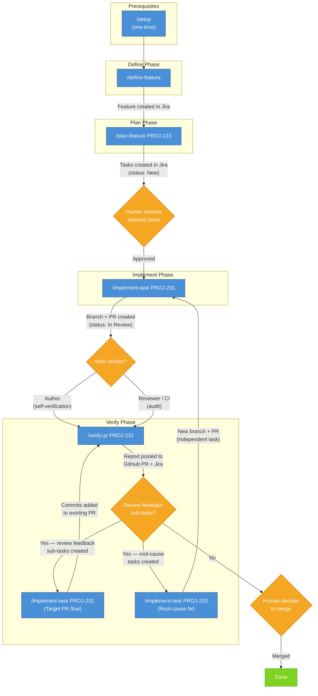

# SDLC Workflow

This document describes the execution workflow for the sdlc-workflow plugin skills.

## Workflow Overview



**Jira state transitions:** New → In Progress (implement-task) → In Review (implement-task) → Done (human merge)

---

## Prerequisite: Setup

**Skill:** `/sdlc-workflow:setup`

Configures a project's CLAUDE.md with the required `# Project Configuration` section. This is a one-time prerequisite for all other skills — plan-feature, implement-task, and verify-pr all validate Project Configuration before executing and will stop if it is missing.

**Invocation:**

```
/sdlc-workflow:setup
```

The setup skill is idempotent — running it multiple times on an already-configured project produces no changes. See [docs/project-config-contract.md](project-config-contract.md) for the required configuration structure.

---

## Execution Phases

The workflow follows four phases: **Define**, **Plan**, **Implement**, and **Verify**.

### Define Phase

**Skill:** `/sdlc-workflow:define-feature`

Interactively walks the user through all Feature description template sections and creates a fully-described Feature issue in Jira.

**Invocation:**

```
/sdlc-workflow:define-feature
/sdlc-workflow:define-feature My Feature Title
```

**Workflow:**
1. Validate Project Configuration in CLAUDE.md
2. Present a roadmap of the 9 template sections
3. Collect Feature summary (title)
4. Walk through each section interactively (with skip support)
5. Offer self-assignment
6. Preview the full description and collect approval
7. Create the Feature issue in Jira (labeled `ai-generated-jira`)
8. Post a summary comment and suggest `/plan-feature` as the next step

**Output:**
- Feature issue created in Jira with a structured description
- Summary comment on the created issue

**Guardrails:**
- Jira-only — no filesystem modifications permitted
- All description content must come from user input — no fabrication
- Issue is never created without user preview and approval

---

### Plan Phase

**Skill:** `/sdlc-workflow:plan-feature`

Converts a Jira feature into structured implementation tasks.

**Inputs:**
- Jira feature issue ID (required)
- Figma design URL (optional)

**Invocation:**

```
/sdlc-workflow:plan-feature PROJ-123
/sdlc-workflow:plan-feature PROJ-123 https://www.figma.com/design/abc123/MyDesign
```

**Workflow:**
1. Validate Project Configuration in CLAUDE.md
2. Fetch feature from Jira
3. Retrieve Figma mockups (if available)
4. Analyze repositories using Serena or fallback tools
5. Build a Repository Impact Map
6. Generate structured Jira tasks with dependencies

**Output:**
- Implementation tasks created in Jira (labeled `ai-generated-jira`)
- Impact map comment on the feature issue
- Issue links (feature incorporates tasks, task dependency chains)

**Guardrails:**
- Planning-only — no file modifications permitted
- All output goes to Jira, never to the filesystem

---

### Implement Phase

**Skill:** `/sdlc-workflow:implement-task`

Takes a structured Jira task and implements it: modifies code, runs tests, commits, opens a PR, and updates Jira.

**Invocation:**

```
/sdlc-workflow:implement-task PROJ-231
```

**Workflow:**
1. Validate Project Configuration in CLAUDE.md
2. Fetch and parse the Jira task description
3. Verify dependencies are Done
4. Transition task to In Progress and assign to current user
5. Inspect code using Serena or fallback tools
6. Create feature branch (named after the Jira issue ID)
7. Implement changes scoped to the task
8. Write and run tests
9. Verify acceptance criteria
10. Self-verify scope containment and sensitive patterns
11. Commit (Conventional Commits, Jira ID in footer, assisted-by trailer)
12. Push branch and open PR
13. Update Jira (PR link, comment, transition to In Review)

**Guardrails:**
- Changes scoped to files listed in the task — no unrelated refactoring
- Code must be inspected before modification
- Incomplete descriptions require user clarification, not improvisation

---

### Verify Phase

**Skill:** `/sdlc-workflow:verify-pr`

Verifies a pull request against its originating Jira task's acceptance criteria and deterministic guardrails. The skill operates on local code for acceptance criteria verification, so it conditionally checks out the PR branch before inspecting files.

**Use cases:**

- **Author self-verification** — the contributor who ran `/implement-task` already has the PR branch checked out locally. The skill detects this and proceeds without a checkout.
- **Reviewer/CI audit** — another person or a headless CI job runs `/verify-pr` from an arbitrary branch. The skill detects the branch mismatch and checks out the PR branch automatically.

**Inputs:**
- Jira task issue ID with an associated PR (required)

**Invocation:**

```
/sdlc-workflow:verify-pr PROJ-231
```

**Workflow:**
1. Validate Project Configuration in CLAUDE.md
2. Fetch and parse the Jira task description
3. Identify the PR from the Jira custom field
4. Checkout the PR branch if not already on it
5. Review feedback resolution — read PR reviews, create sub-tasks for code change requests
6. Root-cause investigation — trace defects through the full workflow chain
7. Scope containment — compare changed files against the task
8. Diff size check
9. Commit traceability — verify Jira ID in commit messages
10. Sensitive pattern scan
11. CI status check
12. Acceptance criteria verification using local code inspection
13. Verification commands (if specified in the task)
14. Generate and post verification report to GitHub PR and Jira

**Output:**
- Verification report posted to both GitHub PR (as a PR comment) and Jira (as an issue comment)
- Review feedback sub-tasks created in Jira (with "Blocks" links and `review-feedback` label)
- Root-cause improvement tasks created in Jira (with `root-cause` label)
- No merge action taken
- No Jira status transition

**Guardrails:**
- Verification-only — does not modify code, merge the PR, or transition the Jira issue
- Criteria come from the Jira task description, not from reading the diff
- Report is informational — a human reviewer decides whether to merge
- Sub-tasks and root-cause tasks are informational — they track required fixes and systemic improvements but do not block verification

> **Design intent:** This workflow builds the foundation for safe auto-merge. Jira
> becomes the source of truth via blocking sub-tasks: once proven reliable, a future
> enhancement adds a merge decision step where verify-pr checks that all blocking
> sub-tasks are Done + all verification checks PASS + CI passes, then auto-merges.
> Auto-merge itself is out of scope for now — but every design decision aligns with
> this end state.

---

## Performance Optimization Workflow

The performance optimization workflow is a specialized workflow for discovering, analyzing, and optimizing frontend application performance. It operates independently of the main SDLC workflow but follows a similar structured approach.

### Performance Setup (One-time)

**Skill:** `/sdlc-workflow:performance-setup`

Initializes Performance Analysis Configuration in the target repository by discovering routes and modules from the codebase.

**Invocation:**

```
/sdlc-workflow:performance-setup
/sdlc-workflow:performance-setup /path/to/target/repo
```

**Workflow:**
1. Determine target repository (argument or current directory)
2. Detect existing configuration (update or skip if exists)
3. Discover routes and user flows from router configuration
4. Discover module registry (lazy-loaded routes, code-split chunks)
5. Collect configuration values (baseline settings, optimization targets)
6. Generate `.claude/performance-config.md` configuration file
7. Create target directories (`.claude/performance/baselines/`, `/analysis/`, `/plans/`, `/verification/`)
8. Validate configuration and output summary

**Output:**
- `.claude/performance-config.md` created in target repository
- Target directories created
- Configuration validated

**Guardrails:**
- Idempotent — running multiple times offers to update or skip
- Does NOT modify source code — only creates configuration file
- All discovered routes/modules must reference actual files

---

### Workflow Discovery

**Skill:** `/sdlc-workflow:performance-workflow-discovery`

Analyzes frontend source code to identify functional workflows (user journeys), presents discovered workflows to the user, and prompts the user to select which workflow to optimize.

**Invocation:**

```
/sdlc-workflow:performance-workflow-discovery
/sdlc-workflow:performance-workflow-discovery /path/to/target/repo
```

**Workflow:**
1. Determine target repository (argument or current directory)
2. Verify Performance Analysis Configuration exists (created by performance-setup)
3. Discover workflows from codebase:
   - Find router configuration files
   - Extract routes and infer workflows by grouping (path prefixes, feature modules, navigation structure)
   - Examine feature module directories
   - Check for user flow documentation
   - Synthesize discovered workflows with complexity estimates
4. Present discovered workflows in formatted table
5. Prompt user to select workflow by number
6. Save selection to `.claude/performance-config.md` (adds "Selected Workflow" section)
7. Output summary with next steps

**Output:**
- Discovered workflows presented in formatted table
- User-selected workflow saved to performance configuration
- Guidance for next steps (load test data, start app, run baseline)

**Guardrails:**
- Requires Performance Analysis Configuration to exist (prompts user to run performance-setup if missing)
- Does NOT modify source code — only updates configuration file
- Discovers workflows from actual source code — no placeholder examples
- If no workflows discovered, stops and informs user

---

### Baseline Capture

**Skill:** `/sdlc-workflow:performance-baseline`

Captures performance baseline metrics for the user-selected workflow by verifying test data availability, executing browser automation to measure page load times and resource loading, and generating a baseline report.

**Invocation:**

```
/sdlc-workflow:performance-baseline
/sdlc-workflow:performance-baseline /path/to/target/repo
```

**Workflow:**
1. Determine target repository (argument or current directory)
2. Verify Performance Analysis Configuration exists and contains selected workflow
3. Prompt user to confirm test data availability (yes/no)
   - If no: display message and exit gracefully
   - If yes: proceed to baseline capture
4. Check if baseline already exists (baseline-report.md in configured location)
   - If exists: prompt user to replace or cancel
5. Copy capture-baseline.template.mjs from plugin cache to target directory
6. Execute script via `node capture-baseline.mjs --config ../path/to/performance-config.md`
7. Parse JSON output and generate baseline-report.md from template
8. Filter scenarios to include only those in selected workflow
9. Save report to configured location (`.claude/performance/baselines/baseline-report.md`)
10. Output summary with key metrics (LCP, FCP, TTI, Total Load Time) and threshold warnings

**Output:**
- `baseline-report.md` created in configured baseline directory
- Baseline includes: timestamp, workflow name, per-scenario metrics, resource timing breakdown, waterfall visualization
- Summary output with aggregate metrics and warnings for exceeded thresholds

**Guardrails:**
- Requires Performance Analysis Configuration with selected workflow (prompts user to run performance-setup and performance-workflow-discovery if missing)
- Verifies test data availability before capturing baseline
- Does NOT modify source code — only creates performance measurement artifacts
- Handles errors gracefully: application not running, Playwright not installed, invalid URLs, missing performance marks
- Filters scenarios to include only those in selected workflow

**Error Handling:**
- **Application not running:** Detects ECONNREFUSED and prompts user to start application
- **Playwright not installed:** Detects missing dependency and provides installation commands
- **Invalid URLs:** Validates localhost URLs and prompts user to fix configuration
- **Missing performance marks:** Detects metric collection failures and suggests checking browser console

---

## Jira Task Structure

Tasks generated by `plan-feature` follow a structured template with these sections:

| Section | Required | Description |
|---|---|---|
| Repository | Yes | Single repository per task |
| Description | Yes | What the task achieves and why |
| Files to Modify | No | Existing files to change, with reasons |
| Files to Create | No | New files to add, with purpose |
| API Changes | No | Endpoints to create or modify |
| Implementation Notes | No | Patterns to follow, code references |
| Acceptance Criteria | Yes | Pass/fail checklist |
| Test Requirements | Yes | Tests to write or update |
| Verification Commands | No | Commands to verify acceptance criteria |
| Target PR | No | Existing PR URL for review feedback fixes |
| Review Context | No | Original review comment that triggered the task |
| Dependencies | No | Prerequisite tasks |

Sections that do not apply are omitted (not left empty). File paths and implementation notes reference real code discovered during repository analysis.
